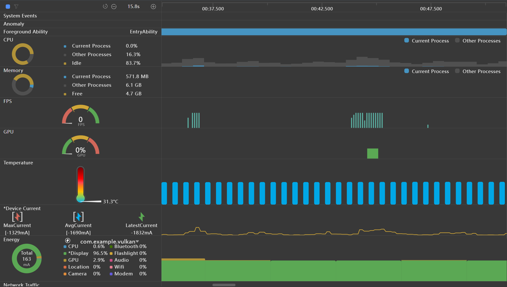
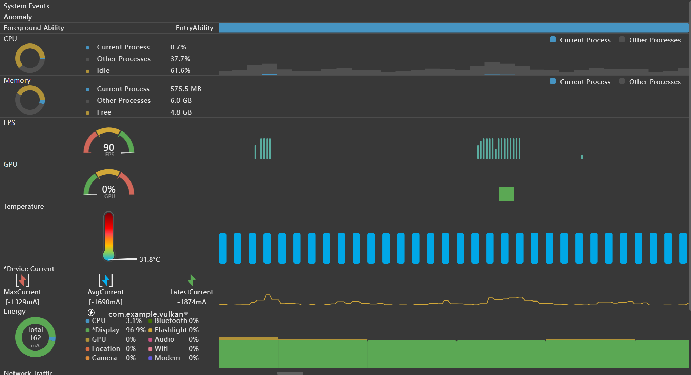

<h1 align="center">实况窗初步检测报告</h1>
<h2 align="center">负责导师: 张严辞</h2>
<h2 align="center">负责组员: 叶家豪 汪铭杰</h2>

### 问题需求
1. [华为视频-华为视频播放窗口最大化(凤凰网里面播放视频，点击视频内横竖屏切换)](#华为视频-华为视频播放窗口最大化凤凰网里面播放视频点击视频内横竖屏切换)
2. [新浪新闻首页向下滑动](#新浪新闻首页向下滑动)
3. [华为商城点击搜索结果页转场](#华为商城点击搜索结果页转场)

### 实验调查
#### 华为视频-华为视频播放窗口最大化(凤凰网里面播放视频，点击视频内横竖屏切换)
##### 检测视频
<video src="1.mp4" controls="controls"></video>

##### 检测结论
未发现明显卡顿现象, 整体观感非常流畅

#### 新浪新闻首页向下滑动
##### 检测视频
<video src="2.mp4" controls="controls"></video>

##### 检测结论
有些许轻微的卡顿, 以及资源的加载存在滞后的现象

##### 模拟项目
```
Program
├───AppScope
│   └───resources
│       └───base
│           ├───element
│           └───media
├───entry
│   └───src
│       ├───main
│       │   ├───ets
│       │   │   ├───components
│       │   │   ├───entryability
│       │   │   ├───entrybackupability
│       │   │   └───pages
│       │   └───resources
│       │       ├───base
│       │       │   ├───element
│       │       │   ├───media
│       │       │   └───profile
│       │       └───dark
│       │           └───element
│       ├───mock
│       ├───ohosTest
│       │   └───ets
│       │       └───test
│       └───test
└───hvigor
```
###### 主要代码
**选项卡**: `main/ets/components/ProductCard.ets`
```ts
@Component
export struct ProductCard {
  @Prop index: number;

  build() {
    Column() {
      Image($r(`app.media.${(this.index % 200) + 1}`))
        .width('100%')
        .aspectRatio(1)
        .objectFit(ImageFit.Cover)
        .borderRadius(8)

      Text(`商品 ${this.index + 1}`)
        .fontSize(14)
        .width('100%')
        .padding(4)
    }
    .width('100%')
    .backgroundColor(Color.White)
    .borderRadius(12)
    .clip(true)
  }
}
```

**选项列表**: `main\ets\components\ProductList.ets`
```ts
import { ProductCard } from './ProductCard';

@Component
export struct ProductList {
  @Prop total: number = 200;
  @State products: number[] = [];
  private batch = 20;

  aboutToAppear(): void {
    this.loadMore();
  }

  private loadMore(): void {
    const rowsNow = this.products.length;          // 当前已有行数
    const rowsTotal = Math.ceil(this.total / 2);   // 总行数
    if (rowsNow >= rowsTotal) return;              // 到底停

    const rowsToAdd = Math.min(this.batch, rowsTotal - rowsNow);
    for (let i = 0; i < rowsToAdd; i++) {
      this.products.push(rowsNow + i);
    }
  }

  build() {
    List({ space: 12 }) {
      ForEach(this.products, (idx: number) => {
        ListItem() {
          Row({ space: 12 }) {
            ProductCard({ index: idx * 2 });
            ProductCard({ index: idx * 2 + 1 });
          }
          .width('50%')
          .padding({ left: 12, right: 12 });
        };
      }, (idx: number) => idx.toString());
    }
    .width('100%')
    .height('100%')
    .backgroundColor('#f2f2f2')
    .onReachEnd(() => this.loadMore());
  }
}
```

**布局**: `main\ets\pages\Index.ets`
```ts
import { ProductList } from '../components/ProductList';

@Entry
@Component
struct Index {
  build() {
    Column() {
      Row() {
        Text('华为应用商城')
          .fontSize(24)
          .fontColor('#fff');
      }
      .width('100%')
      .height(56)
      .backgroundColor('#ff3b8eed')
      .justifyContent(FlexAlign.Center);

      ProductList({ total: 200 })
        .layoutWeight(1);
    }
    .width('100%')
    .height('100%');
  }
}
```

###### 素材使用
- png图片, 大小与华为官网基本保持一致

###### 模拟视频
<video src="2_1.mp4" controls="controls"></video>

###### 性能测试


- **功耗**: 一般稳定在`160-170mh`之间 

###### 模拟结论
未发现明显卡顿,整体运行十分流畅

#### 华为商城点击搜索结果页转场
##### 检测视频
<video src="3.mp4" controls="controls"></video>

##### 检测结论
存在明显的转场停顿, 用户点开界面后需要等待加载几秒才能看见界面

##### 模拟项目
- 沿用[2](#新浪新闻首页向下滑动)项目, 在之前项目的基础上增加新功能

###### 新增代码
**转场页面**: `main\ets\pages\Product.ets`
```ts
import  router  from '@ohos.router';

interface RouterParams {
  imgIndex: number;
}

@Entry
@Component
struct Product {
  private imgIndex: number = (router.getParams() as RouterParams).imgIndex;

  build() {
    Column() {
      Image($r(`app.media.${this.imgIndex}`))
        .width('100%')
        .height('100%')
        .objectFit(ImageFit.Contain)
        .backgroundColor('#000')
        .onClick(() => router.back())
    }
    .width('100%')
    .height('100%')
    .backgroundColor('#000')
  }
}
```

###### 改动代码
**选项卡**: `main/ets/components/ProductCard.ets`
```ts
import router from '@ohos.router';

@Component
export struct ProductCard {
  @Prop index: number;

  build() {
    Column() {
      Image($r(`app.media.${(this.index % 200) + 1}`))
        .width('100%')
        .aspectRatio(1)
        .objectFit(ImageFit.Cover)
        .borderRadius(8)

      Text(`商品 ${this.index + 1}`)
        .fontSize(14)
        .width('100%')
        .padding(4)
    }
    .width('100%')
    .backgroundColor(Color.White)
    .borderRadius(12)
    .clip(true)
    //新增代码部分，点击转场
    .onClick(() => {
      router.push({
        url: 'pages/Product',
        params: { imgIndex: (this.index % 200) + 1 }
      });
    })
  }
}
```

###### 素材使用
- 同 [2](#新浪新闻首页向下滑动)

###### 模拟视频
<video src="3_1.mp4" controls="controls"></video>

###### 性能测试


- **功耗**: 一般稳定在`160-170mh`之间
- **FPS**: 转场时一般在`60`, 有时会到`90`

###### 模拟结论
未发现明显卡顿,整体运行十分流畅

### 实验结论
- 问题1 尚未发现 
- 问题2 经模拟后未能模拟出相似问题
  - high-level program未能发现问题
- 问题3 经模拟后未能模拟出相似问题
  - high-level program未能发现问题

### 实验需求
- 希望能有更为详尽的问题描述
- 希望能提供low-level的项目源码, 以便查找问题
